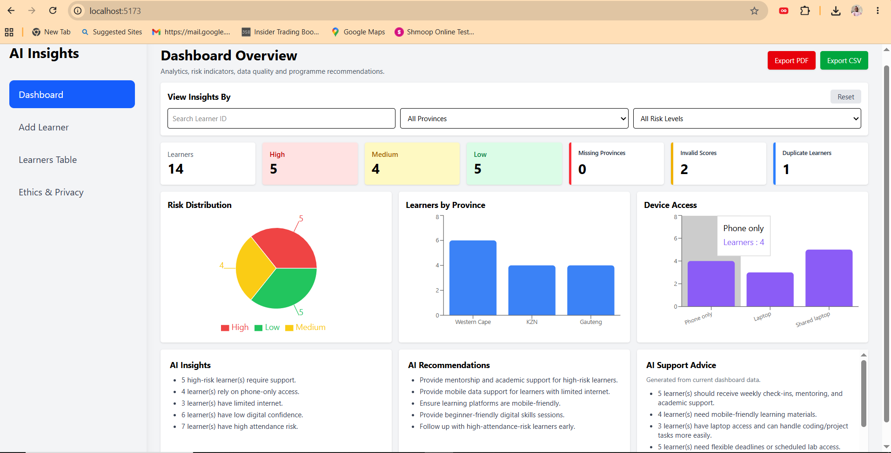

# 🚀 AI-Enabled Student Support Insights Dashboard

## 🎓 Transforming Learner Support Through Data & AI

## Dashboard Overview

## Learner's Table

---

## 🌍 Project Overview

The AI-Enabled Student Support Insights Dashboard is a community-driven solution designed to help programme teams identify learner support needs, monitor participation risks, and make informed decisions using data analytics and AI-supported recommendations.

🔹 Learner Management
🔹 Interactive Analytics
🔹 AI Insights & Recommendations
🔹 Reporting & Exports
🔹 Responsible AI & Privacy

Some learner information may be sensitive, therefore the system incorporates ethical AI principles, privacy considerations, and human oversight mechanisms.

---

## 🎯 Project Objectives

✅ Collect learner information in a structured format

✅ Analyse learner support needs and risk indicators

✅ Visualise learner trends and participation risks

✅ Generate AI-supported insights and recommendations

✅ Improve programme planning and operational efficiency

✅ Demonstrate responsible AI practices

---

## 👥 Learner Management

The system allows programme staff to:

➕ Add Learners

✏️ Edit Learners

🗑️ Delete Learners

📂 Upload CSV Files

🔍 Search Learner Records

📋 View Learner Information

---

## 📊 Dashboard Analytics

The dashboard provides real-time visibility into learner support needs.

### Key Metrics

📈 Total Learners

⚠️ High Risk Learners

🟡 Medium Risk Learners

🟢 Low Risk Learners

📍 Province Distribution

💻 Device Access Analysis

🔎 Data Quality Monitoring

---

## 📈 Risk Distribution Analysis

The system analyses learner information and categorises learners into risk levels.

🟢 Low Risk

🟡 Medium Risk

🔴 High Risk

This helps programme staff prioritise interventions and support activities.

---

## 📍 Province Analysis

The dashboard visualises learner distribution across provinces, allowing teams to identify geographical trends and support requirements.

---

## 💻 Device Access Analysis

Understanding device availability helps programme teams identify potential digital inclusion barriers.

Examples:

💻 Laptop Access

📱 Phone Only Access

👨‍👩‍👧 Shared Device Access

---

## 🤖 AI-Powered Insights

The dashboard automatically generates:

🧠 Learner Insights

💡 Recommendations

⚡ Support Advice

📊 Risk Explanations

Example:

> "A high number of learners rely solely on mobile devices and have limited internet access. Additional data support and mobile-friendly learning resources are recommended."

---

## 📄 Reporting Features

The system supports:

📄 PDF Report Generation

📥 CSV Export

📊 Dashboard Summaries

📋 Programme Reporting

This enables programme staff to share findings and support decision-making.

---

## 🔒 Ethics & Privacy

The project promotes responsible AI by:

🛡️ Protecting learner privacy

⚖️ Encouraging transparency

👥 Maintaining human oversight

🔐 Using synthetic learner data

🚫 Avoiding harmful automation

AI recommendations are designed to support human decision-making rather than replace it.

---

## 🛠️ Technology Stack

### Frontend

⚛️ React

🎨 Tailwind CSS

🌐 React Router DOM

📡 Axios

📊 Recharts

### Backend

🔷 ASP.NET Core Web API (.NET 8)

🗃️ Entity Framework Core

### Database

🗄️ SQL Server

### Additional Libraries

📂 PapaParse

📄 jsPDF

---

## 🏗️ System Architecture

## System Architecture

👤 User

⬇️

⚛️ React Frontend

⬇️

🔷 ASP.NET Core Web API

⬇️

🗄️ SQL Server Database

⬇️

📊 Analytics Engine

⬇️

🤖 Insights & Recommendations

⬇️

📄 Reports & Visualisations

---

## 🚀 Future Improvements

🔐 User Authentication

👥 Role-Based Access Control

🤖 Advanced AI Integration

📈 Predictive Analytics

☁️ Cloud Deployment

📧 Email Notifications

📱 Mobile Application

⚡ Real-Time Dashboards

---

## 👨‍💻 Author

Justice Mabuza

Future Innovation Lab – AI Internship Programme

2026

### 🎓 Data → 📊 Analytics → 🤖 AI Insights → 💡 Recommendations → 🚀 Better Learner Support
